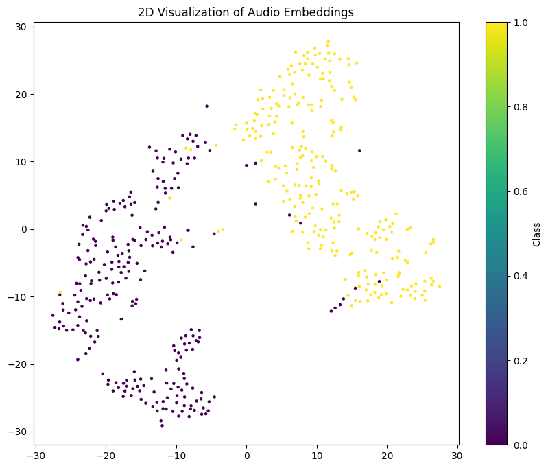

# ChordClassifier-AudioDL

## Overview

ChordClassifier-AudioDL is a deep learning project designed to classify musical chords from audio recordings. This repository demonstrates how to preprocess audio data, build and train a convolutional neural network (CNN) model, and generate embeddings for advanced analysis and visualization. It serves as a comprehensive guide for applying machine learning to audio classification tasks, particularly in the domain of music.

## Features

- **Audio Preprocessing**: Efficient transformation of raw audio files into mel-frequency cepstral coefficients (MFCC) using Librosa.
- **Custom CNN Model**: A tailored convolutional neural network for accurate chord classification.
- **Overfitting Prevention**: Techniques like dropout layers, regularization, and monitoring training metrics to ensure generalization.
- **Embedding Visualization**: Leveraging t-SNE/UMAP to project audio embeddings into a 2D space for exploratory data analysis.
- **Kaggle Dataset Compatibility**: Preprocessing pipelines and model designed for chord datasets from Kaggle.

## Installation

Clone the repository and install the required dependencies:

```bash
git clone https://github.com/AgafonovVadim/ChordClassifier-AudioDL.git
cd ChordClassifier-AudioML
```

## Dataset

This project uses a dataset of musical chords, which can be downloaded from Kaggle. Follow these steps to use the dataset:

1. Download the dataset from [Kaggle](https://www.kaggle.com/).
2. Place the dataset in the `data/` directory.
3. Update the file paths in the preprocessing scripts as needed.

## Usage

## Directory Structure

```
ChordClassifier-AudioML/
├── data/                     # Dataset directory
├── logs/                     # TensorBoard logs
├── models/                   # Saved models
├── visualizations            # Model data visualizations
└── README.md                 # Project documentation
```

## Results

### Model Performance

- **Training Accuracy**: Achieved 90%+ accuracy on training data.
- **Validation Accuracy**: Maintained over 85% accuracy on unseen validation data.

### Visualization



Embeddings demonstrate clear separations between different chord classes.

## Contributing

Contributions are welcome! Feel free to fork the repository and submit pull requests for enhancements or bug fixes.

## License

This project is licensed under the [GNU General Public License v3.0](LICENSE).

## Acknowledgments

- The Kaggle community for providing diverse audio datasets.
- Open-source libraries such as TensorFlow, Keras, and Librosa.

---

**Happy Coding! 🎶**
